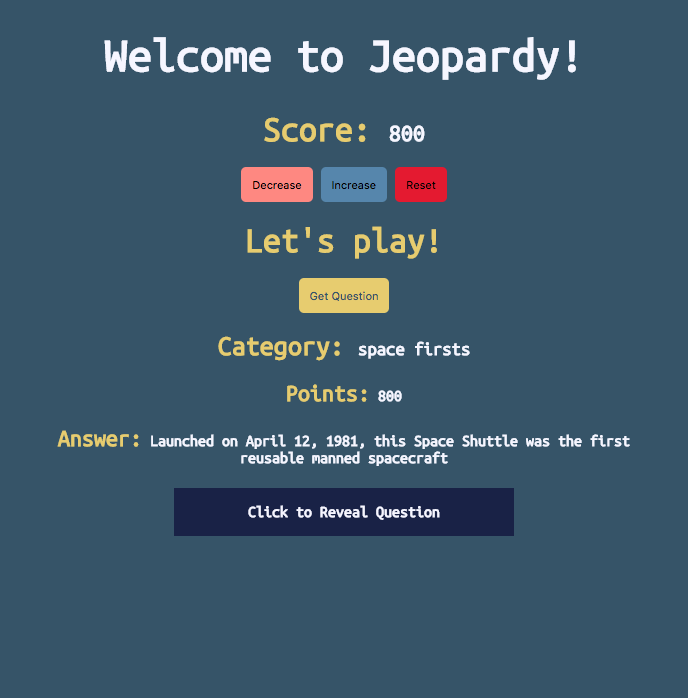

## jService  - Jeopardy Trivia App

### jService API
`jService is an API that has Jeopardy trivia questions and answers available to the public.`

[jService](http://jservice.io/)

`Make a Jeopardy Trivia App using jService!`

1. Make a button labeled `"Random Trivia Question"` or `"Get Question"` or something descriptive.
2. On click, have this button make a GETrequest to get random trivia data. Let's start you off with a win by giving you the URL: `http://jservice.io/api/random`
3. Make some html elements like a `div` where you will display the `question`, `category` and `points`. **NOTE:** You will need to look at the data that is returned to you and think back about how to access data from different data types (is it an array within an object? How do you access the info?).
4. Make another `div` in your HTML where you display the answer
5. Add an on click function that toggles whether or not you can see the `answer`.
6. Add other elements to your page to make it make sense and look good (see attached image)
7. Make a `div` that has an `h2` and two `buttons`
8. Inside the `h2` keep score, start at 0
9. Make one `button` add the points to the score and the other to subtract points from the score (just add or subtract 100 points - using the points value from jService is Hungry for More)
10. Add a little style and color to your app

1. ### Once Completed deploy using NPM RUN BUILD && Netlify
2. ### This should be pushed to github as a repo. The repo is the deliverable.
3. ### In the readme of your project link to your live Netlify link
